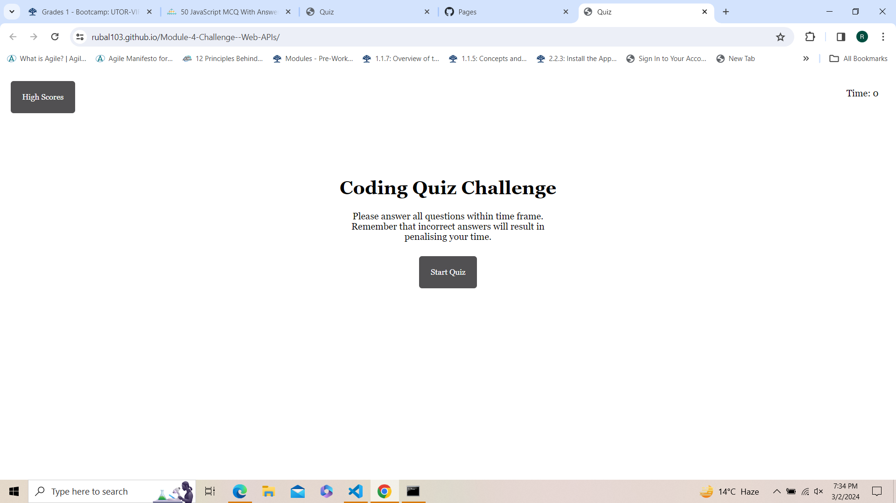
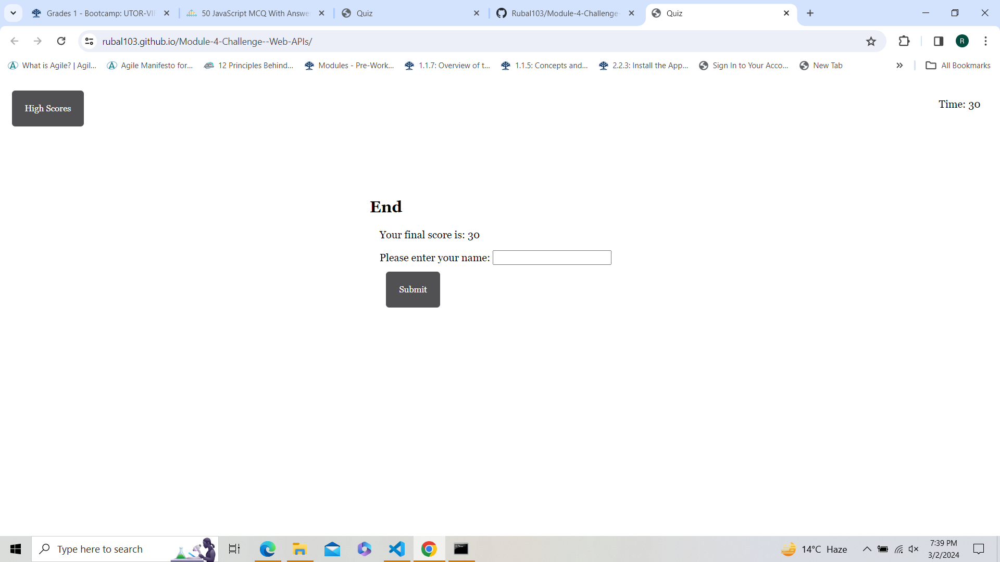
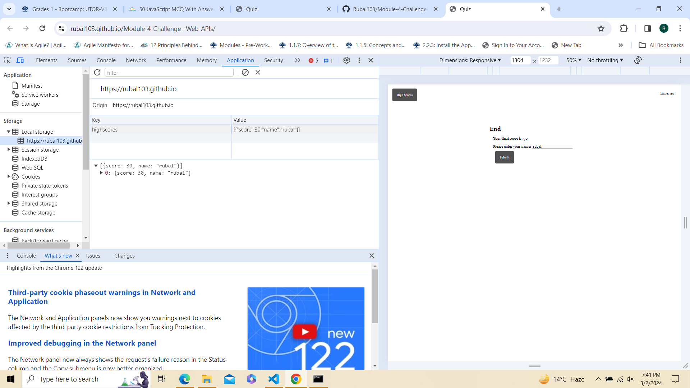

# Module-4-Challenge--Web-APIs

### A timed quiz application was created to test user's knowledge of Javascript and basic HTML
### created with the help of HTML, CSS and javascript
### User's scores are stored in local storage after they click submit 

link to live website: https://github.com/Rubal103/Module-4-Challenge--Web-APIs/settings/pages
link to github repository: https://github.com/Rubal103/Module-4-Challenge--Web-APIs

